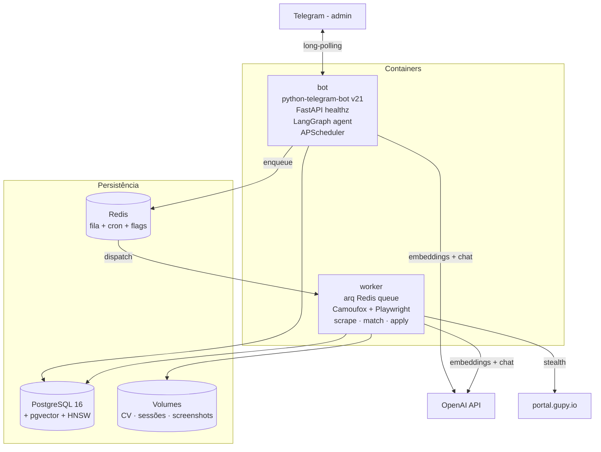
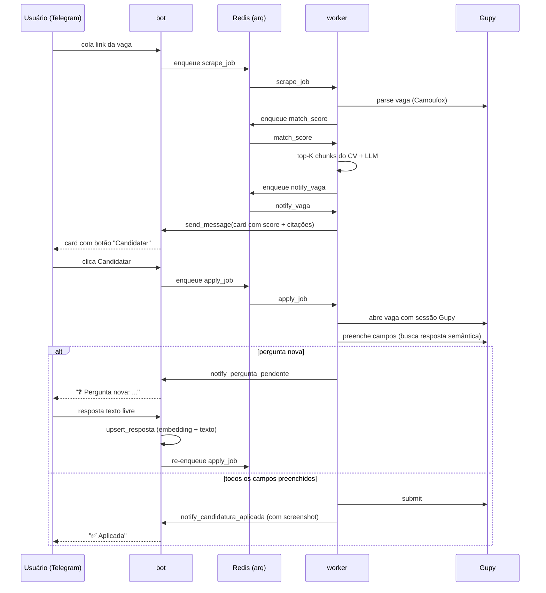
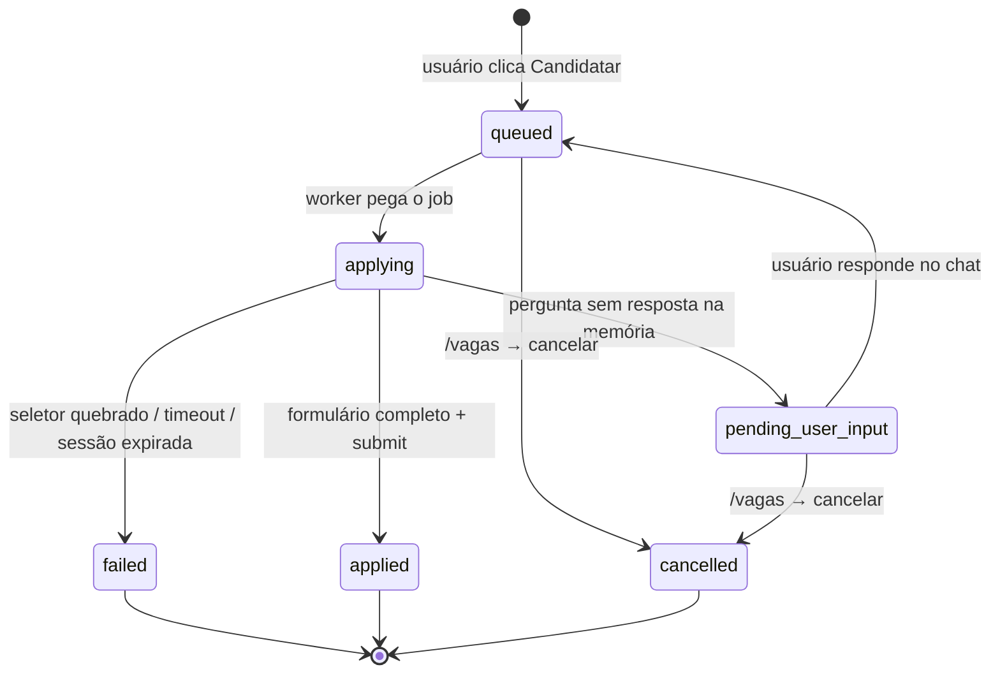

# vagas-bot

Agente de IA via Telegram que descobre vagas no Gupy, ranqueia por fit semântico contra seu CV, e se candidata sob aprovação — pausando para te perguntar quando esbarra em campo novo.

Single-user. Roda em Docker. Persistência em Postgres com pgvector. Fila Redis. Browser anti-detecção (Camoufox). Agente LangGraph com memória persistente. Eval com Ragas.

---

## O que ele faz

- **Descoberta automática** — filtros configuráveis via `/filtros_add`; cron arq de 15 min varre o Gupy e dispara busca para cada filtro vencido.
- **Link drop** — você cola uma URL Gupy no chat e o bot baixa os detalhes, pontua e devolve um card.
- **Matching com RAG** — cada vaga é comparada por similaridade semântica contra chunks do seu CV (top-K via cosine); LLM gera score 0–100 com citações literais do CV.
- **Auto-candidatura com human-in-the-loop** — você clica `✅ Candidatar`; worker abre a vaga com sessão Gupy persistida, preenche campos cujas respostas já existem na memória semântica, e te pergunta no chat quando bate em campo novo. Você responde uma vez, e da próxima ele já sabe.
- **Agente conversacional** — texto livre no chat entra num `StateGraph` LangGraph com tools: `buscar_vagas_semantica`, `explicar_fit`, `listar_candidaturas_em_andamento`, `iniciar_busca_vagas`, `extrair_emails_do_texto`, `enviar_candidatura_por_email`. Memória persistente por `chat_id` via `AsyncPostgresSaver`.
- **Candidatura por e-mail** — você cola um post (LinkedIn etc.) ou um e-mail; o agente extrai contatos, **redige assunto e corpo** a partir do anúncio quando o escopo já está no texto, mostra o rascunho e, após sua confirmação, envia pelo SMTP com anexo do CV ativo (PDF).
- **`/admin`** — painel inline com métricas, health, logs recentes e controles (pause/resume scrape, forçar busca, limpar fila).

---

## Arquitetura



### Fluxo de uma candidatura



### State machine da candidatura



---

## Decomposição

```
app/
├── core/               infra compartilhada (config, db, redis, crypto, logging, llm, rag, telegram)
├── browser/            Camoufox factory + flows (search, parse_job, apply)
├── features/
│   ├── onboarding/     /start
│   ├── sessao_gupy/    storage_state criptografado com Fernet + /relogin
│   ├── cv/             upload PDF, parse PyMuPDF, chunks, embeddings
│   ├── filtros/        CRUD + ConversationHandler 6 passos
│   ├── descoberta/     scrape periódico + link drop + dedupe URL/semântico
│   ├── matching/       RAG-based scoring com citações
│   ├── respostas/      memória Q/A com lookup semântico (cosine ≥ 0.88)
│   ├── candidatura/    state machine + auto-apply com human-in-the-loop
│   ├── agente/         LangGraph + tools + AsyncPostgresSaver
│   └── admin/          /admin com métricas, health, controles
└── tools/
    └── gupy_login.py   CLI helper que roda no host (display real) e captura sessão
```

Cada feature traz `models.py`, `service.py`, `handlers.py`, e opcionalmente `tasks.py` (jobs arq) e `notifier.py` (envia mensagens proativas).

**Regra de dependência:** features não importam outras features. Comunicação só via Postgres e fila Redis. Única exceção: `features/agente` (orquestrador) chama services das demais como tools.

---

## Stack

| Camada | Ferramenta |
| --- | --- |
| Runtime | Python 3.12 (async-first) |
| Web | FastAPI + uvicorn |
| Bot | python-telegram-bot v21 |
| ORM | SQLAlchemy 2.x async + Alembic |
| DB | PostgreSQL 16 + pgvector (HNSW) |
| Vetores | OpenAI `text-embedding-3-small` (1536 dims) |
| Fila | arq + Redis (com cron_jobs) |
| LLM | LangChain (`gpt-4o-mini` FAST; toggle p/ Anthropic) |
| Agente | LangGraph + AsyncPostgresSaver |
| Browser | Camoufox (Firefox stealth) + Playwright |
| Parse PDF | PyMuPDF |
| Cripto | cryptography (Fernet) |
| Logs | structlog (JSON) com redaction de segredos |
| Eval | Ragas (Faithfulness, AnswerRelevancy, ContextPrecision) |

---

## Setup

```bash
cp exemplo.env .env
```

Preencha no `.env`:

- `TELEGRAM_BOT_TOKEN` — token do bot via @BotFather
- `TELEGRAM_ADMIN_USER_ID` — seu user id (use @userinfobot)
- `OPENAI_API_KEY` — API key da OpenAI
- `FERNET_KEY` — gere com:
  ```bash
  python -c "from cryptography.fernet import Fernet; print(Fernet.generate_key().decode())"
  ```
- Opcional — candidatura por e-mail (Gmail: 2FA + senha de app): `SMTP_USER`, `SMTP_PASSWORD`; opcionais `SMTP_HOST` (padrão `smtp.gmail.com`), `SMTP_PORT` (587), `SMTP_FROM_NAME`.

### Subir a stack

```bash
# build + sobe tudo em background (postgres, redis, bot, worker)
docker compose up -d --build

# aplica migrations (1ª vez ou depois de pull com mudanças de schema)
docker compose exec bot alembic upgrade head

# confere health
curl http://localhost:8000/healthz
```

> Atalhos equivalentes via Makefile: `make up`, `make migrate`, `make logs`, `make down`.

### Operação (docker compose)

```bash
# logs em tempo real (todos os serviços)
docker compose logs -f

# só do bot ou do worker
docker compose logs -f bot
docker compose logs -f worker

# rebuild + restart depois de mudar código
docker compose build bot worker
docker compose up -d bot worker

# restart sem rebuild (ex.: bot travou no polling)
docker compose restart bot

# recriar containers do zero (útil quando muda .env)
docker compose up -d --force-recreate bot worker

# parar tudo (mantém volumes)
docker compose down

# parar e apagar volumes (CV, sessões, screenshots, DB) — destrutivo
docker compose down -v

# status dos containers
docker compose ps

# shell no container
docker compose exec bot bash
docker compose exec worker bash

# python REPL no container do bot
docker compose exec bot python

# rodar alembic manualmente
docker compose exec bot alembic upgrade head
docker compose exec bot alembic downgrade -1
docker compose exec bot alembic current

# truncar tabelas (sem dropar schema)
docker compose exec postgres psql -U vagas -d vagas -c "TRUNCATE candidatura, vaga, cv_chunk, cv_translation RESTART IDENTITY CASCADE;"
```

### Login Gupy (única vez, e depois sob demanda)

Camoufox precisa de display real para o login interativo — **rode no host, não no Docker**:

```bash
cd vagas-bot
# Windows
.venv/Scripts/python -m app.tools.gupy_login
# Linux/Mac
.venv/bin/python -m app.tools.gupy_login
```

Janela do Camoufox abre, você loga no Gupy, tecla ENTER no terminal. A sessão é criptografada (Fernet) e gravada no Postgres do container — reusada pelo worker em toda candidatura.

Quando expirar, o worker vai marcar a candidatura como falha com "sem sessão Gupy ativa; rode /relogin". Mande `/relogin` no chat (instruções) e rode o CLI de novo.

### Token do Telegram revogado

Se o bot começar a crashar com `InvalidToken` (token vazou ou foi regenerado):

1. @BotFather → `/mybots` → seu bot → API Token → Revoke / gere novo
2. Atualize `TELEGRAM_BOT_TOKEN` no `.env`
3. `docker compose up -d --force-recreate bot worker`

### CV

Envie seu CV em PDF como **documento** no chat. O bot parseia, chunka (~400 tokens, overlap 50), embeda com OpenAI e indexa no pgvector. `/cv` mostra status.

---

## Comandos do Telegram

| Comando | O que faz |
| --- | --- |
| `/start` | saudação |
| `/cv` | versão e nº de chunks do CV ativo |
| `/upload_cv` | (envie PDF como documento) |
| `/relogin` | instruções pra recapturar sessão Gupy |
| `/filtros` | lista filtros com botão pausar |
| `/filtros_add` | conversa 6 passos pra criar filtro |
| `/insta_search` | dispara busca imediata pra todos os filtros ativos |
| `/vagas` | candidaturas em andamento + botão cancelar |
| `/respostas` | memória de Q/A com botão remover |
| `/admin` | painel: métricas, health, logs, controles |
| _texto livre_ | agente LangGraph (ou resposta a pergunta pendente) |
| _URL Gupy_ | dispara scrape_job + match + card |

---

## Eval

```bash
export OPENAI_API_KEY=...
make eval
cat eval/report.md
```

Dataset dourado em `eval/datasets/matching_golden.jsonl`. Métricas: **Faithfulness** (justificativa não inventa skills), **Answer Relevancy**, **Context Precision**.

---

## Segurança

- `admin_only` em todo handler — qualquer user_id diferente de `TELEGRAM_ADMIN_USER_ID` recebe "Não autorizado" e vira log.
- Sessão Gupy criptografada com Fernet em `bytea` no Postgres.
- structlog tem processor de redação: `cookie`, `authorization`, `*_token`, `password`, `*_key` viram `***` automaticamente.
- Loggers barulhentos (`httpx`, `telegram`) silenciados em WARNING para não vazar token via URLs de exception.

---

## Custos

Single-user (~50 vagas/dia, conversa moderada): **~$3-5/mês** total (embeddings + matching + agente).

---

## Tests

```bash
make test
```

Unit tests com SQLite in-memory onde possível. Features que usam pgvector têm testes marcados `skip` (cobertos por smoke test integrado contra Postgres real).
